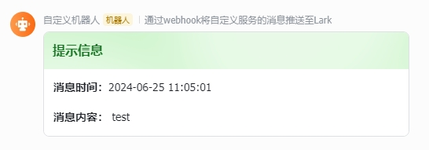

# Necor Bot Starter

Necor Bot Starter 是一个自定义的 Spring Boot Starter 项目，用于集成企业微信 **(暂未支持)** 和Lark的机器人功能。通过简单的配置，您可以方便地在 Spring Boot 应用中使用企业微信和Lark的机器人发送消息。

## 功能特性

- 支持Lark机器人发送卡片消息
- 支持区分消息级别

## 快速开始

### 引入依赖

在您的 `pom.xml` 文件中添加以下依赖：

```xml
<dependency>
    <groupId>com.necor.bot</groupId>
    <artifactId>necor-bot-starter</artifactId>
    <version>1.0.0</versincy>
</dependency>    
```

### 配置文件

在 `application.yml` 或 `application.properties` 中添加以下配置：

```yml
spring:    
  application:    
    name: my-app    

necor:    
  bot:  
    lark:  
      url: https://open.larksuite.com/open-apis/bot/v2/hook/xxxxxx  
```

### 使用方式

```java
@Autowired  
private BotPusher botPusher;  

botPusher.push(Level.INFO, "test");  
```

### 结果展示



## 贡献

欢迎提交问题和贡献代码！请通过 [GitHub issues](https://github.com/lx027688/necor-bot-starter/issues) 报告问题，或者提交 [Pull Request](https://github.com/lx027688/necor-bot-starter/pulls) 来贡献代码。

## 许可证

Necor Logging Starter 使用 [MIT](https://github.com/lx027688/necor-bot-starter/blob/master/LICENSE) 许可证 开源。

---

感谢使用 Necor Bot Starter。如果您有任何问题或建议，请随时联系我们。